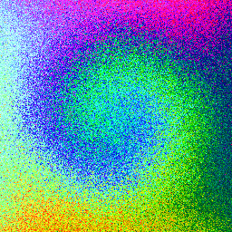

# kbImageScramble

A 15-puzzle where every tile is a pixel of a photograph — scramble it with hundreds of
millions of random moves, then watch it solve itself back one pixel at a time.

**▶ Try it: https://kevinabrandon.github.io/kbImageScramble/**

<p align="center">
  
  
</p>
<p align="center"><em>The gradient board before and after 100,000,000 counter-clockwise
swirl moves. Every pixel is still in there — <strong>Solve!!</strong> walks each one home.</em></p>

Drop in any image and scramble it into noise for as long as you like — it runs until you
stop it, and you can change the speed while it goes — then
hit **Solve!!** and watch the hole run through the image, escorting every pixel back home
row by row until the picture reassembles itself. **Flip!!** solves to the upside-down
image instead; the **Swirl** modes (↻/↺) bias the scramble into a clockwise or
counter-clockwise rotation so the photo smears rather than dissolves; **Stuipd Solve** *[sic]* solves greedily and visibly fails forever, on purpose.
A single **Speed** slider controls how much you watch live — from redrawing every
million moves at full tilt down to every single move with up to 128 ms between them
(it auto-sets to fit the board size) — and the **Resize** slider drops the photo's
resolution — all the way down to 4 pixels on the short side, a
true 15-puzzle — so you can watch the solver work tile by tile, then slide back up to
restore the full photo — big images open pre-shrunk to ~512 (slide right for full size,
which caps at 2048). A **Load Preset** menu offers a kbToyTracer render, the original
2008 test photo, and a smooth hue/lightness gradient board (`?img` deep-links it).
Play it by hand, too: arrow keys move the hole when the image is focused, clicking a
tile next to the hole slides it in, and large tiles show their 15-puzzle numbers.

## History

Born from a brother-to-brother coding challenge in January 2008: who could first
auto-solve a 15-puzzle — and then, what if instead of 15 tiles it was every pixel of a
photograph? The algorithm was worked out by solving a physical 15-puzzle by hand and
writing down the steps. The original 2008 sources are preserved offline and may be
published here someday.

## Running / building

The app is static files in `web/public/` — serve them any way you like:

```
cd web/public && python3 -m http.server 8000
```

The engine is the original January 2008 C++, compiled unmodified to WebAssembly. To
rebuild it after touching `web/wasm/`, install [emsdk](https://emscripten.org) and:

```
./web/wasm/build.sh
node web/test/smoke.mjs   # scrambles + solves a test image, asserts pixel-perfect restore
```
